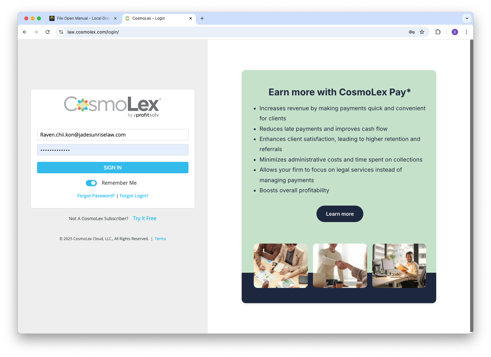
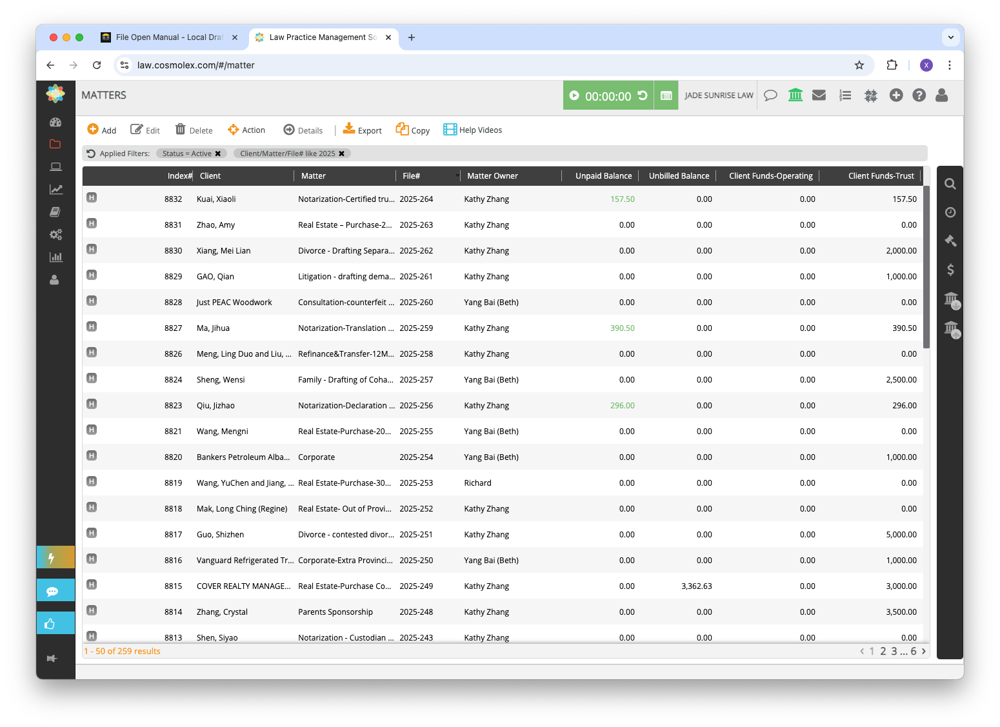
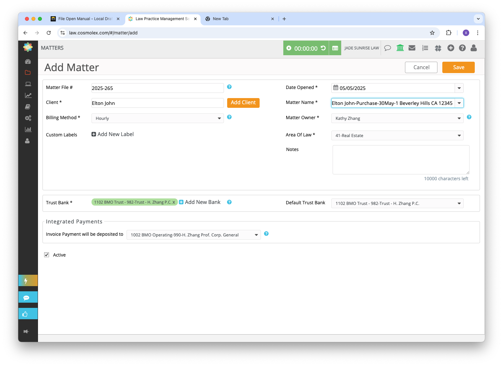
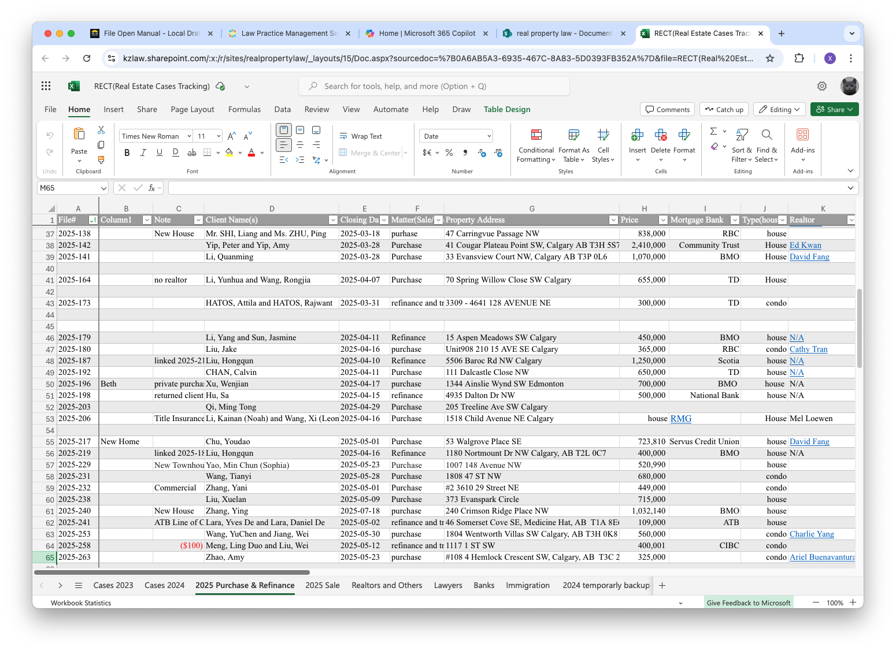
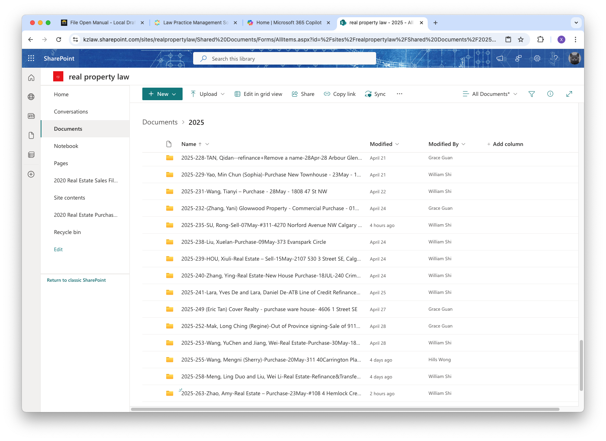
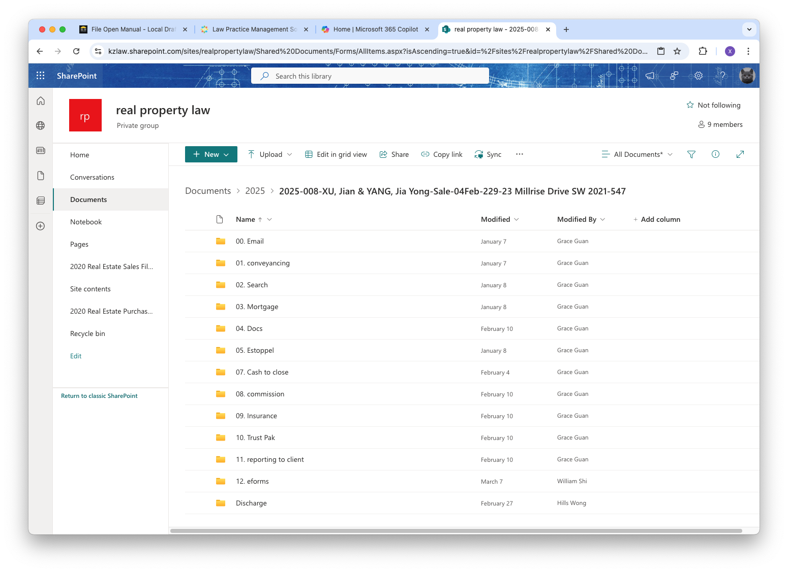
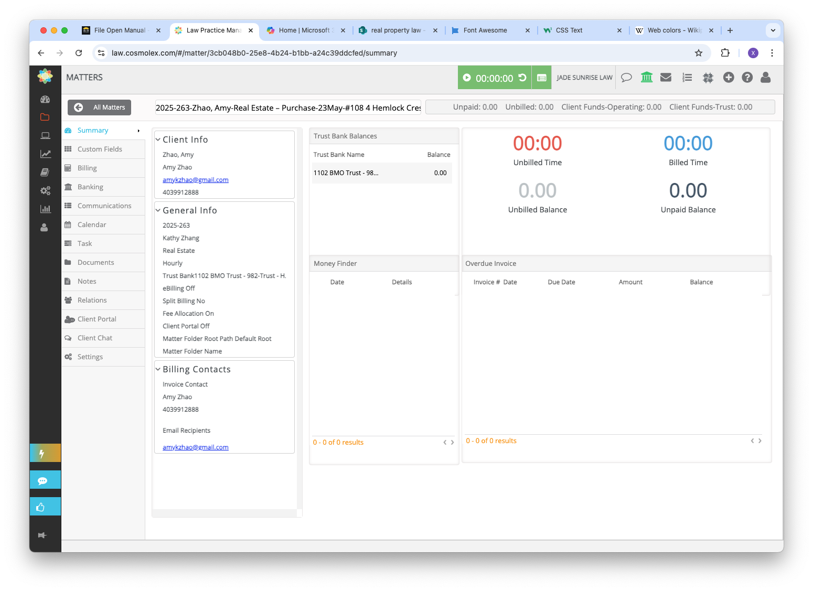

# File Open Manual

<!-- more -->

## Real Estate

### Designate A File Number

Open [CosmoLex](https://law.cosmolex.com/login/){:target=" \_blank"} Portal,

find the recent opened files list,

and use the next available number as your new file number. For example, you may use `2025-265` or any number greater than that.

### Enter Important File Information

There are two places you need to enter important file information, [CosmoLex](https://law.cosmolex.com/login/){:target=" \_blank"} and [Real Estate Tracking Spreadsheet](https://kzlaw.sharepoint.com/:x:/s/realpropertylaw/EaO1ago1aXxGioNdA5P7NSoBDdb04Sd0OOv0p6-JN2xEcg?e=aKJdR3){:target=" \_blank"}.

You should have the contact information for both the realtor and the client ready before entering the details.

### Create A New Folder

For each new file, create a folder in the appropriate SharePoint directory. 

For real estate files, the root folder is [real property law](https://kzlaw.sharepoint.com/sites/realpropertylaw){:target=" \_blank"}. If you do not have access to this folder, please contact Grace to request authorization.

Navigate to the `2025` sub-folder and create a new folder using the following naming convention:

`fileNumber-clientName-Sale/Purchase/Refinance-closingDate-propertyAddress postalCode`

For the above fictional file, the folder name should be,

`2025-265-Elton John-Purchase-30May-1 Beverley Hills CA 12345`

The next step is to move all existing documents into the new folder. It's important to organize them into clearly labeled sub-folders for easy access. You're free to use any folder names that make sense to you. Here are some examples:

### Make a Physical Binder

Please print all the documents and organize them into a binder.

For purchase and refinance files, please use a beige binder <i style="color: Khaki" class="fa-regular fa-folder-open"></i>. For sale files, use an orange binder <i style="color: Orange" class="fa-regular fa-folder-open"></i>. 

Additionally, please print a cover letter for the binder. Use the `cosmoLex` summary page to generate the cover letter.

For any important issues, such as who is responsible for the legal fees or whether the client is in Calgary for signing, please make sure to note them directly on the cover letter for easy reference.

## Notarization

## Family

## Wills

## Litigation

## Consultation

